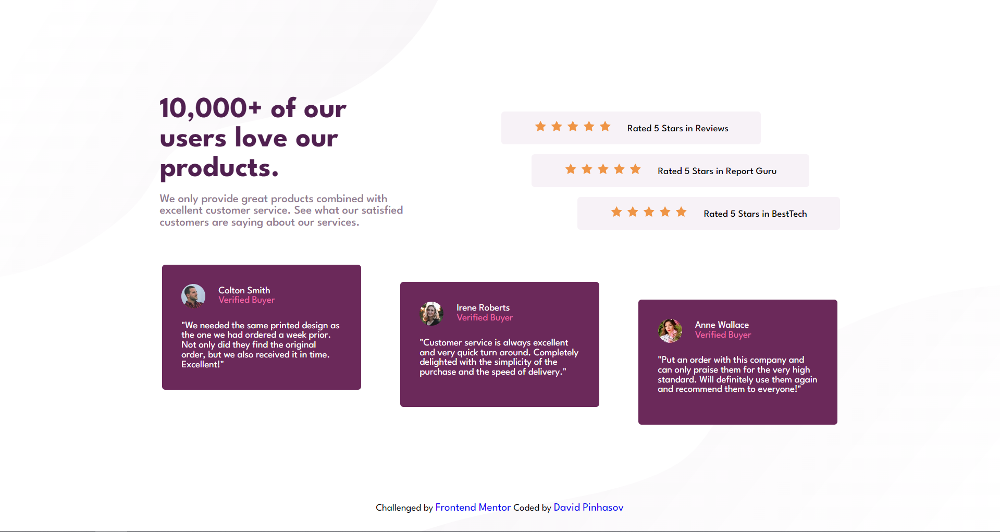

# Frontend Mentor - Social proof section solution

This is a solution to the [Social proof section challenge on Frontend Mentor](https://www.frontendmentor.io/challenges/social-proof-section-6e0qTv_bA). Frontend Mentor challenges help you improve your coding skills by building realistic projects. 

## Table of contents

- [The challenge](#the-challenge)
- [Screenshot](#screenshot)
- [Links](#links)
- [Built with](#built-with)
- [Useful resources](#useful-resources)
- [Author](#author)

### The challenge

Users should be able to:
- View the optimal layout for the section depending on their device's screen size

### Screenshot

### Links

- Solution URL: [Add solution URL here](https://your-solution-url.com)
- Live Site URL: [Add live site URL here](https://your-live-site-url.com)

### Built with

- Semantic HTML5 markup
- CSS custom properties
- Flexbox
- Mobile-first workflow

### Useful resources

- [CSS Flexbox Cheatsheet](https://flexboxsheet.com/)
- [A Complete Guide to Flexbox](https://css-tricks.com/snippets/css/a-guide-to-flexbox/)

## Author

- Github- [David-Pinhasov](https://github.com/David-Pinhasov/Frontend-Mentor.git)
- LinkedIn- [David pinhasov](https://www.linkedin.com/in/david-pinhasov-7512641b7)
- Frontend Mentor- [@David-Pinhasov](https://www.frontendmentor.io/profile/David-Pinhasov)